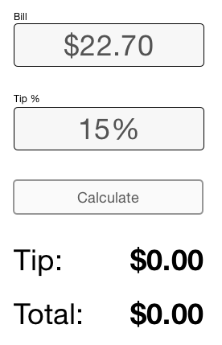

# CSS - Layout with Flex Box

Flex Box is a system used to arrange blocks on single horizontal or 
vertical axis. 

## Learning Objectives/Competencies

1. Define a flex parent
1. Identify flex items
1. Identify the main axis and the cross axis
1. Use Flex Box to arrange elements on horizontal and vertical axis 
1. Align items on the cross axis

## Initial Exercise

- CSS Flex Box

## Overview/TT I 

- Intro to Flex Box
  - What is it, what is it used for?
  - Flex parent, and flex items
- Axis 
  - Define: Main Axis vs cross axis
  - Driction defines the main axis

## In Class Activity: [Example-1](example-1)

Use Flex box to build a "card" that describes a video game character. 

The "card" is made up of several pieces. 

- Image
- Title
- Power
- R.O.F.
- Health

Arrange these items with Flex Box.

- flex-direction
- justify-content
- align-items

The goal is to explore the properties above and see their effects in the browser. 

## In Class Activity: [Example-2](example-2)

This example is liek the first but has more than one item. Use Flex box on the parent element along with flex box on the children in each card. 

- Use flex-wrap
- Use flex-box on more than one element to create more complex layout

## In Class Challenge [Challenge 1](challenge-1)

You've been hired to work on a new app that gets people to go out for lunch  more often. It needs a tip calculator. Your job is to build the tip calculator. 

The design team has provided a mock up. 

Start with the markup [here](challenge-1/index.html).

While you are working on this look for the following things:

- Identify the Flex Parent
- Identify the Main Axis
- Idenitfy the Cross Axis
  - There may be elements in a sub parent with a different Axis
- Apply a base font to the Body Tag
  - Set Font Family 
  - Set Font Size
- Think about the Box Model (this applies especially to the inputs!)
  - Use Padding
  - Use Border
  - Use Margin
- Think about the last two elements: **Tip** and **Total**
  - These each contain two items layed out across a horizontal axis

## After Class

- Work on your Personal Home Page
- Complete as many levels of Flex Box Zombies as you can

## Additional Resources

1. https://mastery.games/p/flexbox-zombies
