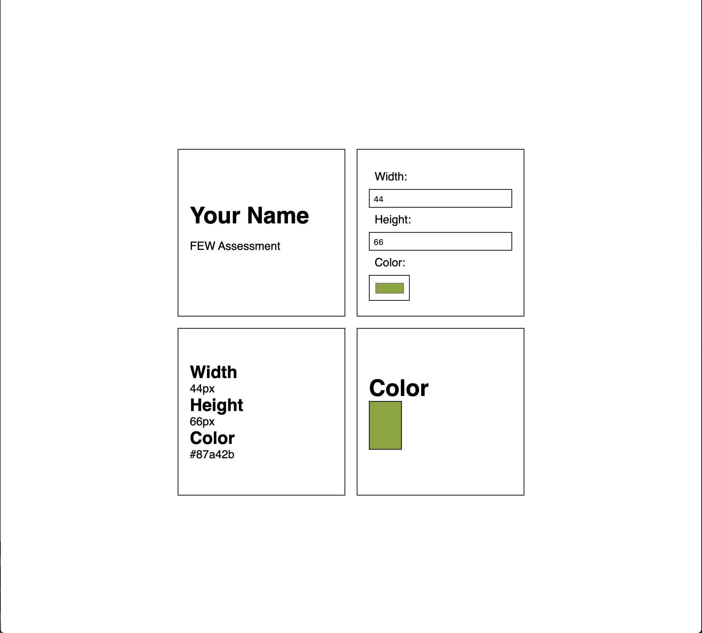

# FEW Assessment

The assessment will be score for each section. 

1. Semantic HTML
2. CSS
3. JavaScript

The goal is to recreate the example. 

You goal is to make a web page that looks like the images above. 

You will also be adding some JavaScript to recreate the functionality shown in this animation. 

## Challenge 1 - HTML

1. Markup a page with four sections
	1. The first section should contain your name and "FEW Assessment" 
	2. The second section will display Width, Height, and Color. 
	3. The third section will contain three form elements. These should be labeled. The first two allow numbers, and last allows color input. 
	4. The last section Shows a colored rectangle. 

## Challenge 2 - CSS

You must write the CSS here yourself, do not use Bootstrap or any other CSS library. 

1. Arrange the four squares in a Grid. You should use CSS Grid for this. 
2. Position the grid in the center of the screen.
3. Use Flexbox to arrange the elements in each square in a column. You must use Flexbox here. 

## Challenge 3 - JavaScript

You must use vanilla JS for this section, no libraries. 

1. Use event listeners to display values entered in the form elements in the box in the lower left. See the example above. 
	- Changing the width in the width box should display the value of the width followed by "px". 
	- Changing the height should display the value entered followed by "px".
	- Changing the color should display the color as a hex value. 
2. When the values are entered the the box in the lower right corner should display a rectangle at the size of the numbers entered in px, and the color of the color entered. 

