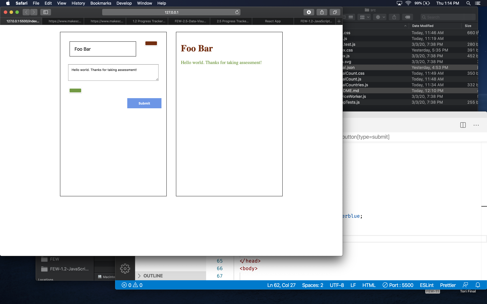

# FEW 1.1 Final Assessment

Your goal is to create an interface that allows anyone to create a custom message. 

The interface will look like this: 

On the left is a form and on the right is the display. 

Entering text into the title input should display the text as the title on the right. 

Entering text into the message input on the left display the text on the right side. 

There are two color pickers one for the title and the other for the message. Choosing a color should set the color of the displayed message on the right side. 

## Challenge 1

Create an HTML file. Include all of the boilerplate HTML code. This should inlcude the following tags: 

- doctype
- html
- head 
- title
- body

## Challenge 2

Create a container div that will hold arrange to child divs.

The div on the left will contain a form that allows us to input and format a message, and the box on the right will display the formatted message. 

## Challenge 3 

The div on the left should contain a form with the following elements: 

- title - input type text
- title color - input type color 
- message - textarea
- message color - input color 
- button type submit

## Challenge 4 

The div on the right will display the formatted message. It should contain the following elements: 

- title display - h1 
- message display - p

## Challenge 5 

Use CSS to arrange the elements using Flex box. 

- The two main elements, inside container, should be side be in a row.
- The form elements in the left box should be arranged in a column. 

## Challenge 6

You need to assign ids to the dynamic elements. 

- Give an id to each of the form elements: 
  - input
  - textarea
- Give an id to the two elements in the right box. This should be: 
  - h1
  - p

## Challenge 7 

For each of the elements you assigned an id define a variable that has a reference to that element. 

You should have 6 variables. 

These variable should constants since they will not be reassigned. 

## Challenge 8 

Use event listeners ('input') to display the value of the title input in the title display h1. 

You should be adding an event listener to the title input. In the handle function set the innerHTML of the title display to the value of the title input. 

## Challenge 9 

Use an event listener to display the text you enter in the message textarea in the message display p. 

## Challenge 10 

Add a listener to the title color input. 

The handler for this event should set the color of the title display h1 to the value of the title color input. 

You can set a CSS style on an element with JS through the elements style property. 

`titleDisplay.style.color = '#f00'`

## Challenge 11

Add a listener ('input' event) to the message color input. Use it's value to set the color of the message display p. 

## Extra Credit

## Challenge 12

This message styling thing is good but it could be better if we could choose a font! 

Create a select element. Make a list of fonts. 

Add a listener (change event) that sets the font of both the title display and message display to the value of the select element. 

## Challenge 13 

Wow this is looking good. But, we need to be able to set the size of the fonts. 

Add an input type range to make a slider. Give a min value of 11 and a max value of 60. 

Add an event listener. The handler for this listener should set the fontSize of the title element. 

## Challenge 14 

Ass above but the new slider sets size of the message text. 

