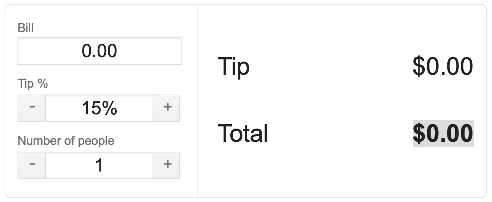

<!-- .slide: data-background="./Images/header.svg" data-background-repeat="none" data-background-size="40% 40%" data-background-position="center 10%" class="header" -->
# FEW 1.1 - Lesson 7 - JS Introduction

<!-- Put a link to the slides so that students can find them -->

➡️ [**Slides**](/Syllabus-Template/Slides/Lesson1.html ':ignore')

<!-- > -->

## JavaScript

You need to learn some JavaScript! This class will be an introduction to the JavaScript langauge and programming for the web browser. 

<!-- > -->

### Why JavaScript?

JavaScript is probably the most important language in use today. It's for a wide range of uses from web pages, to mobile applications, embeded in hardware devices, and web servers. You could build entire application ecosystems with only JavaScript. 

It's a good time to learn JavaScript.

<!-- > --> 

## Objectives 

- Use JavaScript
  - variables 
  - functions 
- Use the Browser API
  - reference DOM elements 
  - events and listeners

<!-- > -->

## JavaScript 

<!-- > -->

## Writing JS 

Written in a tag

Written in JS files

<!-- > -->

## The JavaScript Language

- variables 
- functions 
- flow control 
- objects 

<!-- > -->

### Variables

Define a variable with

- var 
- const 
- let 

<!-- > -->

```js 
var x = 11
let y = 'Hello'
const z = 3.14
```

What's the difference? 

- var is function scope
- let is block scope
- const is block scope and immutable

Best practice: 

Use `const` when a value won't change and `let` when it will. Don't use `var`. 

### functions 

define a function

```JS 
function calculateArea(length, width) {
  const area = length * width
  return area
}
```

Execute a function:

```js 
calculateArea(10, 3) // 30
```

### Flow control 

Flow control is how your program makes decisions. This includes things like if else statements and loops. 

#### if else 

```js 
if (area > 50) {
  console.log('More than 50')
} else {
  console.log('Less than 50)
}
```

#### for loop 

```JS 
for (let i = 0; i < 10; i += 1) {
  console.log(i)
}
```

### types 

Any value in JavaScript will be one of these types: 

- Number
- String 
- Object

### Numbers

Numbers are what you expect numbers.

- 0 
- 1
- 3.1456
- -0.988

### Strings

A String is any number of characters between quotation marks. 

- 'Hello World'
- "Foo Bar"
- ''

### Concatenate String 

Concatenation is the processs of combining Strings and numbers into a single string. For example: 

```JS
const name = 'Burger'
const price = 2.99
const nameAndPrice = `${name} $${price}`
console.log(nameAndPrice) // Burger $2.99
```

### Getting a Reference

Elements created in the DOM are objects. They have methods and properties. You'll need a reference to an element if you need to:

- change the text it displays
- get the value currently displayed
- change it's style 

To get a reference to an element you'll need to find it in the DOM. An easy method is using an id. ids are unique there should only be one element with a given id!

Use: 

```js
<div id="display-hello">Foo Bar</div>
...
const displayHello = document.getElementById('display-hello')
```

### Display text with innerHTML

Setting the innerHTML of an element replaces everything between the tags with something new. 

```JS 
displayHello.innerHTML = 'Hello World'
```

### Working with Inputs

DOM elements are not all the same. Different types of elements have different proeprties. `<input>` elements for example allow user input and store the input value in a value property. 

```JS
<input id="input-name">
const inputName = document.getElementById('input-name')
console.log( inputName.value ) // shows the value if input
```

## Events and Listeners 

Events are things that happen in the program. They are things like: 

- text input
- clicking the mouse
- interacting with the keyboard
- and more...

Add a listener to "listen" for an event type and define a handler to handle the event when it occurs.

```JS
<button id="submit-button">Submit</button>
...
const button = document.getElementById('submit-button')
button.addEventListener('click', buttonHandler)
function buttonHandler(event) {
  ...
}
```

element.addEventListener() takes two parameters: an event type and an event handler. 

An event type is a string. Some event types are: 

- 'click'
- 'change'
- 'keydown'

A handler is a function that takes an event as a parameter. 

In JavaScript functions are also values you could rewrite the code above like this: 

```JS
<button id="submit-button">Submit</button>
...
const button = document.getElementById('submit-button')
button.addEventListener('click', function(e) { ... })
```

Here we would way the function is anonymous since it doesn't have a name. 

## Lab - Tip calculator

Your goal is make a tip calculator. Take a look at this one:

https://www.google.com/search?q=tip+calculator&oq=tip



Play with this, calculate a few tips. What happens? How are the values calculated and displayed? 

Your goal is write a program that emulates this tip calculator. You'll need to create markup for the calculator, your markup will become the structure and user interface. Your CSS styles will determine how the user interface is presented and what it looks like, amd you'll write JavaScript to define the functionality and logic that makes the tip calculator calculate and display tips. 

Look at the example tip calculator and take inventory of the elements you need. 

- Bill - eleemnt: `<input>`
- Tip - element: `<input>`
- Number of people - element: `<input>`
- Display tip - element: ???
- display total - element: ???

Follow the challenges below and see how much each you can complete from memory. 

**Challenge 1** 

Create the markup for the tip calculator. 

- Create an HTML file 
- Write the base HTML document tags 
- Add tags and HTML markup for calculator elements
  - bill - input
  - tip - input 
  - number of people - input 
  - display tip - ???
  - display total - ???

The two display elements can be almost any element. Since you won't be inputing the a value an input is probably not appropriate these could be: `<div>`, `<p>`, `<h#>` or ???

**Challenge 2**

You'll need to add attributes to the tags. The inputs could use a type. Each of the tags in the list above needs to have an id. 

When writing the id names you'll be repeating these names in your JS code so it would be a good idea to have a naming convention. Discuss your naming covention with another student. 

- input tags get type attribute could be "number" or "text"
- All of the tags need an id name

I chose to use kabob case for all id names, and used these names: 

- input-bill
- input-tip
- input-people
- display-tip
- display-total

**Challenge 3**

Add a script tag to the bottom of the body. This should be below all of the other tags but inside the body element. 

`<script></script>`

You'll write your code here. 

**Challenge 4**

Define vairables for each of the elements. You'll be creating references to DOM elements and storing them in variables in this step. You should have a naming convention. 

Get the reference to the DOM element using `document.getElementById('id-name')`

Use a naming convention for these variables you'll need to keep track of them. Explain your naming convention to another studfent. 

I used camel-case for these variable names. For example: 

```js
const inputBill = document.getElementById('input-bill')
...
```

**Challenge 5**

Add listeners to each of the input fields. These listeners should listen for the 'change' event. A change event occurs when the value of an input changes. So as a user enters text or numbers as each new character is entered the handler for this event is executed. 

```js 
inputBill.addEventListener('change', function(e) {
  
})
```

or 

```js 
inputBill.addEventListener('change', handleBill)

function handleBill(e) {

}
```

When a change occurs you'll want to calculate the new tip amount and bill total. To do this you will need to get the values for the tip percentage, bill amount, and the number of people. To get the value entered in an input use: `input.value`. For example:

```js 
const const percent = inputTip.value
```

When you get a value like this from an input it will always be a string even if the value input was a number. JS provides a couple functions that convert strings to numbers. 

- `parseFloat(value)` - for decimal values like the bill
- `parseInt(value)` - for whole numbers like number of people

For example: 

```js 
const const percent = parseInt(inputTip.value)
```

You need to get the bill, tip, and number of people to calculate the tip. Calculate the tip something like: 

```JS 
const tip = bill * percent / 100
const total = bill + tip
```

**Challenge 6**

Last, display the tip and the total. You can do this by setting the `innerHTML` of the element. For example: 

```JS
displayTip.innerHTML = tip
```

**Stretch Challenges**


<!-- > --> 

## Let's review 


<!-- > -->

## After Class

This week your goal is to follow the tutorial: 

https://github.com/soggybag/js-tutorial-slide-show

[Assignment 5](../assignments/assignment-05.md)

Be sure to watch all of the tutorial videos and complete the example project presented. 

You can also try the stretch goals listed in the read me. 

As you work take note of any problems you encounter bring these to class with you 
